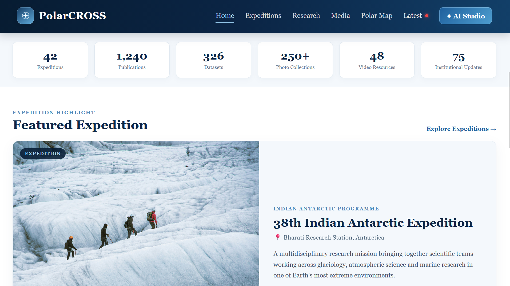
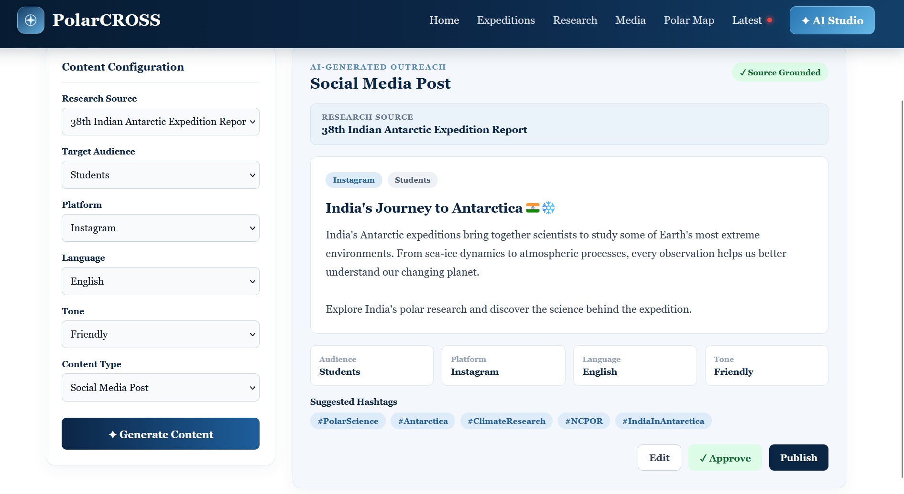

# PolarCROSS

### Integrated Polar Science Outreach, Knowledge Repository and Media Dissemination Portal

**SIH 2026 — Problem Statement SIH26063**  
**Team:** Solstice — NSUT  
**Organization:** Netaji Subhas University of Technology (NSUT)

---

## Overview

PolarCROSS is a unified digital platform for organizing, discovering, and disseminating polar science knowledge.

Polar research produces a wide range of valuable information including expedition reports, scientific publications, datasets, photographs, videos, institutional activities, and educational resources. However, this information can be distributed across different sources and formats, making discovery and outreach difficult.

PolarCROSS addresses this challenge by providing a centralized knowledge repository combined with intelligent search, expedition-centric exploration, interactive visualization, analytics, and AI-assisted science communication.

The platform is designed to serve researchers, students, educators, institutions, and the general public through a single accessible ecosystem.

---

## Problem

Polar science information is often:

- Distributed across multiple platforms and repositories
- Available in different formats with inconsistent metadata
- Difficult to search and discover in a unified manner
- Disconnected from expedition and geographic context
- Difficult to convert into accessible educational and outreach content
- Underutilized for public engagement and science communication

PolarCROSS brings these resources together into a structured and searchable ecosystem.

---

## Solution

PolarCROSS provides a centralized platform that combines:

- A structured polar science knowledge repository
- Expedition-centric content discovery
- Advanced search and filtering
- Interactive polar map visualization
- Multimedia resource management
- AI-assisted outreach and content generation
- Source-grounded knowledge retrieval
- Analytics and content insights
- Editorial review and publishing workflows

The system is designed so that scientific information remains connected to its original sources while being made easier to discover and communicate to different audiences.

---

## Screeshots




---

## Key Features

### Knowledge Repository

A centralized repository for managing different types of polar science resources:

- Research publications
- Expedition reports
- Datasets
- Photographs
- Videos
- Institutional activities
- Educational resources
- Other scientific documents and media

Resources are organized using standardized metadata to improve discovery and reuse.

### Smart Search & Discovery

Users can search and explore the repository using:

- Keywords
- Resource types
- Topics
- Expeditions
- Dates
- Locations
- Researchers and institutions
- Other metadata

The search and indexing layer helps users discover relevant resources across different formats.

### Expedition-Centric Exploration

PolarCROSS organizes information around polar expeditions, allowing users to explore related reports, publications, datasets, media, locations, activities, and research outputs.

### Interactive Polar Map

The platform provides an interactive geographic interface for exploring polar research and expedition-related information.

### AI Outreach Studio

PolarCROSS includes an AI-assisted outreach layer designed to help transform scientific information into accessible communication material for different audiences and formats.

### Source-Grounded AI

The AI layer uses Retrieval-Augmented Generation (RAG) to retrieve relevant information from the platform's knowledge repository before generating content. This keeps generated content connected to the available scientific resources.

### Editorial Review

AI-generated and submitted content can pass through an editorial workflow where authorized users can review, verify, edit, approve, and publish content.

### Analytics

Analytics can provide insights into popular resources, search trends, content engagement, audience interests, and resource usage patterns.

### Metadata Management

Structured metadata improves searchability, classification, filtering, discovery, interoperability, and content organization.

---

## System Architecture

```text
                    ┌─────────────────────────┐
                    │      PolarCROSS Users   │
                    │ Researchers / Students   │
                    │ Educators / Public      │
                    └────────────┬────────────┘
                                 │
                                 ▼
                    ┌─────────────────────────┐
                    │    React Web Frontend    │
                    │ Repository / Map / Search│
                    │ Outreach / Analytics     │
                    └────────────┬────────────┘
                                 │
                                 ▼
                    ┌─────────────────────────┐
                    │     FastAPI Backend      │
                    │ API + Business Logic     │
                    └────────────┬────────────┘
                                 │
              ┌──────────────────┼──────────────────┐
              │                  │                  │
              ▼                  ▼                  ▼
      ┌──────────────┐   ┌──────────────┐   ┌──────────────┐
      │  PostgreSQL  │   │    Object    │   │    Search    │
      │   Database   │   │   Storage    │   │   / Indexing │
      └──────────────┘   └──────────────┘   └──────────────┘
              │                  │                  │
              └──────────────────┼──────────────────┘
                                 │
                                 ▼
                    ┌─────────────────────────┐
                    │   AI Outreach Engine     │
                    │   RAG + Retrieval        │
                    │   Content Generation     │
                    └────────────┬────────────┘
                                 │
                                 ▼
                    ┌─────────────────────────┐
                    │   Editorial Workflow     │
                    │ Review → Approve →       │
                    │ Publish                  │
                    └─────────────────────────┘
```

---

## Technology Stack

### Frontend

- React
- Vite
- JavaScript
- HTML5
- CSS3

### Backend

- Python
- FastAPI
- REST APIs

### Database

- PostgreSQL
- Supabase

### Storage

- Object storage for documents and multimedia resources

### Search & Retrieval

- Search and indexing layer
- Metadata-based filtering
- Retrieval pipeline for AI applications

### AI / ML

- Large Language Models
- Retrieval-Augmented Generation (RAG)
- Source-grounded content generation
- Automated metadata assistance

### Visualization

- Interactive map integration
- Analytics and data visualization

---

## User Roles

### Public Users

- Explore polar science resources
- Search the knowledge repository
- Browse expeditions
- Explore the interactive map
- Access educational and outreach content

### Researchers

- Discover research resources
- Explore expedition information
- Access publications and datasets
- Search scientific material using structured metadata

### Students & Educators

- Discover educational resources
- Explore polar research
- Use simplified science communication material
- Learn through expedition and geographic context

### Administrators / Editors

- Manage repository resources
- Manage metadata
- Review submitted content
- Review AI-generated outreach material
- Approve and publish content
- Monitor analytics

---

## Core Workflow

### Resource Management

```text
Resource Upload
      ↓
Metadata Assignment
      ↓
Storage & Indexing
      ↓
Repository
      ↓
Search / Discovery
```

### AI Outreach Workflow

```text
User Request
      ↓
Query Processing
      ↓
Knowledge Retrieval
      ↓
Relevant Scientific Sources
      ↓
AI Content Generation
      ↓
Editorial Review
      ↓
Approved Content
      ↓
Publication
```

---

## Data Flow

1. Scientific resources are uploaded or added to the repository.
2. Metadata is assigned or generated for each resource.
3. Documents and media are stored in the appropriate storage layer.
4. Metadata and searchable content are indexed.
5. Users search and explore resources through the frontend.
6. Relevant resources can be retrieved by the AI layer.
7. The RAG pipeline provides source context to the language model.
8. AI-assisted outreach content is generated from the retrieved information.
9. Editors review and verify generated content.
10. Approved content can be published for the intended audience.

---

## Design Principles

- **Centralized Knowledge** — Bring polar science resources into one structured ecosystem.
- **Discoverability** — Make scientific information easier to find and explore.
- **Contextual Exploration** — Connect resources with expeditions, locations, and research activities.
- **Source Grounding** — Keep AI-assisted communication connected to underlying scientific information.
- **Human Verification** — Maintain editorial review for published outreach content.
- **Accessibility** — Make complex scientific information easier to understand for different audiences.
- **Scalability** — Use modular components that can evolve as the repository grows.

---

## Project Structure

```text
PolarCROSS/
│
├── frontend/
│   ├── components/
│   ├── pages/
│   ├── services/
│   └── ...
│
├── backend/
│   ├── api/
│   ├── models/
│   ├── services/
│   └── ...
│
├── README.md
└── ...
```

---

## Expected Impact

PolarCROSS aims to improve the accessibility and discoverability of polar science by providing a unified platform for knowledge management and outreach.

The platform helps:

- Researchers discover related scientific resources
- Students and educators access structured learning material
- Institutions organize and disseminate polar research
- The public engage with polar science
- Content teams transform scientific knowledge into accessible outreach material
- Organizations understand resource usage through analytics

---

## Team

**Team Solstice — NSUT**

Developed for **Smart India Hackathon 2026** under:

**Problem Statement:** SIH26063  
**Title:** Integrated Polar Science Outreach, Knowledge Repository and Media Dissemination Portal  
**Organization:** Ministry of Earth Sciences (MoES) / National Centre for Polar and Ocean Research (NCPOR)

---
